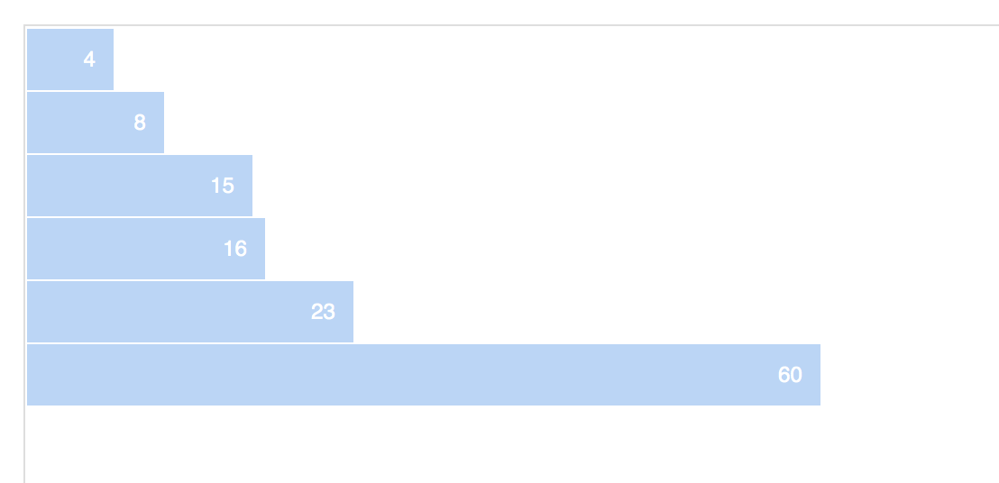

# Tutorial D3 Journocoders Madrid

Para este primer encuentro seguiremos un tutorial del creador de D3.js, Mike Bostock, con el que crearemos un gráfico de barras muy sencillo.

El tutorial original, podéis encontrarlo en este link: http://bost.ocks.org/mike/bar/

A continuación una versión adaptada del mismo, paso a paso:

## Cómo generar un gráfico de barras en D3

Primero, crea el esqueleto HTML:

```
<!DOCTYPE html>
<html>

  <meta charset="utf-8">
  <script src=""></script>

  <head>

    <style type="text/css">
    </style>

  </head>

  <body>

    <div></div>
    
    <script>
    </script>

  </body>

</html>

```

Dentro de head, introduce la ruta a D3.js en la fuente del script (Importante: sin esta ruta no verás el gráfico)
Puedes extraerla de aquí: http://d3js.org

```
  <script src="//d3js.org/d3.v3.min.js"></script>
  
```

Añade los estilos del gráfico dentro de la etiqueta <head>:

```
    <style type="text/css">

    .chart div {
      font: 10px sans-serif;
      background-color: steelblue;
      text-align: right;
      padding: 3px;
      margin: 1px;
      color: white;
      }

    </style>
```

Puedes personalizar los estilos:
  * Cambia el tamaño o el tipo de la fuente (font)
  * Modifica el color del gráfico. Puedes expresar el color como "steelblue" o con colores HEX como este azul #BAD4F6
  * Edita el ancho de las barras (padding) o el margen (margin) entre ellas
  
```
    <style type="text/css">

    .chart div {
      font: 12px sans-serif;
      background-color: #BAD4F6;
      text-align: right;
      padding: 10px;
      margin: 1px;
      color: white;
      }

    </style>
```

Pasamos a la etiqueta body del código HTML. Es momento de introducir el script donde escribiremos nuestro código en D3.js

En primer lugar, los datos que queremos representar en nuestro primer gráfico de barras

```
   <script>

      var data = [4, 8, 15, 16, 23, 42];

  </script>
  
```

En segundo lugar, el domain y el range del eje x del gráfico

```
   <script>
   
      var x = d3.scale.linear()
        .domain([0, d3.max(data)])
        .range([0, 420]);

      d3.select(".chart")
        .selectAll("div")
        .data(data)
        .enter().append("div")
        .style("width", function(d) { return x(d) + "px"; })
        .text(function(d) { return d; });
        
    </script>
    
```

Por último, cargaremos los datos que hemos definido antes en el gráfico:

```
    <script>

      var data = [4, 8, 15, 16, 23, 42];

      var x = d3.scale.linear()
        .domain([0, d3.max(data)])
        .range([0, 420]);

      d3.select(".chart")
        .selectAll("div")
        .data(data)
        .enter().append("div")
        .style("width", function(d) { return x(d) + "px"; })
        .text(function(d) { return d; });

    </script>
    
```

El código final es el siguiente:

```
<!DOCTYPE html>
<html>

  <meta charset="utf-8">

  <head>

    <script src="//d3js.org/d3.v3.min.js"></script>

    <style type="text/css">

    .chart div {
      font: 12px sans-serif;
      background-color: #BAD4F6;
      text-align: right;
      padding: 10px;
      margin: 1px;
      color: white;
      }

    </style>

  </head>

  <body>

    <div class="chart"></div>

    <script>

      var data = [4, 8, 15, 16, 23, 60];

      var x = d3.scale.linear()
        .domain([0, d3.max(data)])
        .range([0, 420]);

      d3.select(".chart")
        .selectAll("div")
        .data(data)
        .enter().append("div")
        .style("width", function(d) { return x(d) + "px"; })
        .text(function(d) { return d; });

    </script>

  </body>

</html>
```


Puedes ver el resultado en este link: http://bl.ocks.org/adrianblanco/da9fed51f09ee1ec0724


Ésta es sólo la primera parte para generar un gráfico de barras en D3. Puedes continuar con ["Let's Make a Bar Chart II"](http://bost.ocks.org/mike/bar/2/), donde se introducen los SVG, un concepto clave en D3.js, y ["Let's Make a Bar Chart III"](http://bost.ocks.org/mike/bar/3/)
